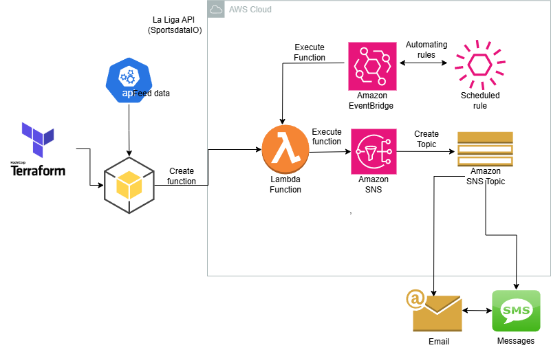

<p align="center">
  
  
## ☁️ 30 Days DevOps Challenge - Building a Game Day Notification System with Terraform  ☁️

This is the 8th project for the 30 days DevOps All Star Challenge!

In this project I built a Sports Alert system that is automated with Terraform which will alow the creation of the fetching the API key, creating the lambda function of our app, and setting up the alerts with Cloudwatch and SNS topics!


<h2>Environments and Technologies Used</h2>

  - Amazon Web Services (AWS)
  - RapidAPI
  - Terraform
  - Python
  - Gitpod
  - Lambda
  - Cloudwatch
  

  
<h2>Key Features</h2>  

✅ Infrastructure as Code (IaC) with Terraform: Automate AWS resource provisioning (Lambda, CloudWatch, SNS) using Terraform for reproducibility, scalability, and version-controlled infrastructure

✅ Sports API Integration: Securely fetch and manage API keys (e.g., AWS Secrets Manager) to retrieve real-time sports data (scores, schedules, or alerts) from third-party providers.

✅ Serverless Data Processing: AWS Lambda functions written in Python/Node.js to process and filter sports data on a scheduled or event-driven basis (e.g., hourly game updates).

<h2>Step by Step Instructions</h2>

***1. Repo and API configuration***

We will begin by setting up the environment and code that we will be utilizing. In this instance, we will use gitpod to create a new workspace and do the commands from there. We will be setting up an account with RapidAPI for our Premier League Standings data.

I created a .yml script for gitpod where it will automatically install AWS CLI and set the AWS credentials with the environment variables defined in Gitpod. This makes sure that our future projects are automated and we can start right away.

To achieve this, we will go to Gitpod's settings and set our credentials with the variables `AWS_ACCESS_KEY_ID`, `AWS_SECRET_ACCESS_KEY` and `AWS_DEFAULT_REGION` Respectively.


Finally, we will make sure our dependencies are installed properly.

```
pip install boto3
pip install python-dotenv
pip install requests
```

We will then install terraform CLI:

```
sudo wget -O - https://apt.releases.hashicorp.com/gpg | sudo gpg --dearmor -o /usr/share/keyrings/hashicorp-archive-keyring.gpg
echo "deb [arch=$(dpkg --print-architecture) signed-by=/usr/share/keyrings/hashicorp-archive-keyring.gpg] https://apt.releases.hashicorp.com $(lsb_release -cs) main" | sudo tee /etc/apt/sources.list.d/hashicorp.list
sudo apt update && sudo apt install terraform


***Option 2: Local AWS CLI Setup***

NOTE: Keep in mind this is for a Linux environment, check the AWS documentation to install it in your supported Os.

   ```
   curl "https://awscli.amazonaws.com/awscli-exe-linux-x86_64.zip" -o "awscliv2.zip"
unzip awscliv2.zip
sudo ./aws/install
```
We then do `AWS configure` and enter our access and secret key along with the region. Output format set to JSON. With this command we will double check that our credentials are put in place for CLI:

```
aws sts get-caller-identity
```


Lastly, we will make sure we store our api key safely:

```
aws ssm put-parameter --name "esp-api-key" --value "<API_KEY>" --type "SecureString"
```

***2.  Run Terraform Commands ***

In this step we will be configurating and setting up the terraform commands to automate and create our resources! 

We first begin by initializing Terraform with the provider plugins (AWS) and local backend setup.

```bash
terraform init
```

Then we format Terraform config files to make it clean, readable  and following best practices.

```bash
terraform fmt 
```

Next, we check the terraform configuration for syntax errors and correctness.

```bash
terraform validate
```

We then show a preview of changes that will take place with Terraform infrastructure before being applied.

```bash
terraform plan
```

Finally, we create or update the infrastructure based on the Terraform configuration:

```bash
terraform apply
```

NOTE: When done, you can remove all services defined with 

```bash
terraform destroy
```


***3. Create SNS Topic and create a JSON policy***


In this step,  we will create a subscription with an Email and SMS protocol. Replace arn with user-generated topic arn as well as the email to be subscribed to and phone number.

```
aws sns subscribe \
    --topic-arn arn:aws:sns:us-east-1:123456789012:esp_game_alerts \
    --protocol email \
    --notification-endpoint youremail.com
```


```
aws sns subscribe \
    --topic-arn arn:aws:sns:us-east-1:123456789012:gd_topic \
    --protocol sms \
    --notification-endpoint yourphonenumber
```
You can check the subscriptions on the CLI(Replace the topic ARN) or in the console.

```
aws sns list-subscriptions-by-topic \
    --topic-arn arn:aws:sns:us-east-1:123456789012:gd_topic
```


This is how it will look like in the console.


***4. Final Result - Test the Function**


We open the function and copy-paste the code from the repository (or you can fine-tune to your liking and modify)


Before we deploy the function though, we set the environment variables.


Finally, we test the result by creating a test event and testing it out.


And Voila! We now have the data with the names of the team, the score, and even the formations!


NOTE: If there are no matches in a current date, for example, it can get no data therefore showing notifications like these:


NOTE2: When there are a lot of dates involved, we might need to adjust the timeout so that the SNS i published with this command:

```
aws lambda update-function-configuration --function-name gd_notifications --timeout 30
```


<h2>Conclusion</h2>

This project combines infrastructure automation with event-driven serverless architecture, demonstrating modern DevOps practices for building reliable, low-maintenance alert systems. Ideal for sports enthusiasts or as a template for scalable notification workflows!
